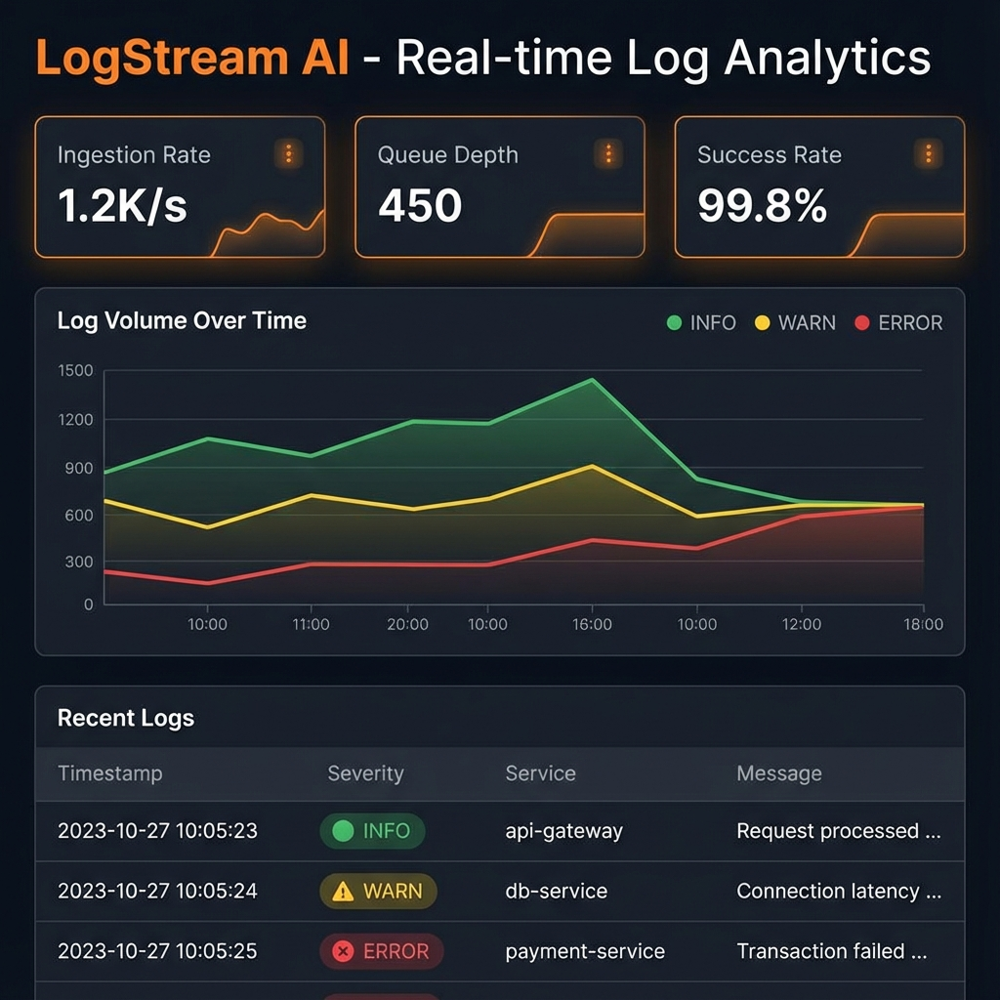
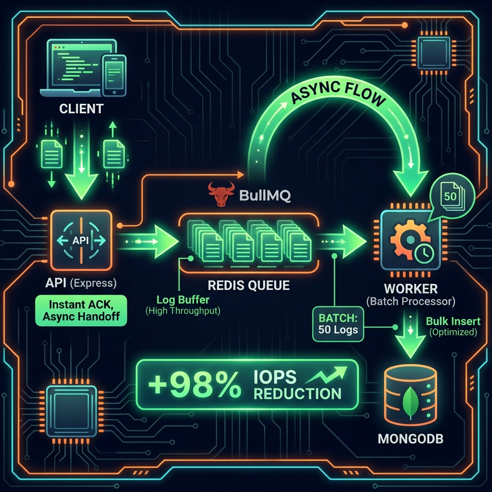

# LogStream AI
## High-Throughput Log Ingestion & Observability Platform

<div align="center">


**Tech Stack**


**Patterns**


</div>

---

## Visual Overview

### Real-time Dashboard

<p align="center">
  
</p>

*Live log analytics with severity-based visualization and metrics*

### Architecture Flow

<p align="center">
  
</p>

*Event-driven architecture with 98% IOPS reduction through batch processing*

---

## Overview

**LogStream AI** is a high-throughput log ingestion and observability platform designed to handle high traffic using Event-Driven Architecture and Batch Processing.

### The Problem

Traditional log systems write to the database synchronously, creating bottlenecks during traffic spikes and wasting database IOPS.

### The Solution

**Decoupled Architecture**: API instantly acknowledges logs (< 10ms response) by pushing to Redis, while a separate worker batches 50 logs per write, reducing database IOPS by 98%.

### Key Features

- **Asynchronous Ingestion**: API response time < 10ms regardless of DB load
- **Batch Processing**: 98% reduction in Database IOPS (writes 50 logs in 1 call)
- **Type Safety**: Full TypeScript implementation across all services
- **Real-Time UI**: Server Components with instant search, filtering, and pagination
- **Visualizations**: Interactive charts using Apache ECharts

---

## System Architecture

The system decouples **ingestion** from **storage** to ensure zero latency for clients:

1. **Ingestion API**: Receives logs via HTTP, validates payload (Zod), instantly pushes to Redis Queue
2. **Message Broker**: Redis (BullMQ) acts as buffer to absorb traffic spikes
3. **Batch Worker**: Separate microservice pulls logs, buffers in memory, writes to MongoDB in batches of 50 (Bulk Write)
4. **Dashboard**: Next.js 14 application providing real-time analytics, filtering, and searching

---

## Tech Stack

- **Frontend**: Next.js 14 (App Router), TypeScript, Tailwind CSS, Framer Motion, Apache ECharts
- **Backend**: Node.js, Express, TypeScript
- **Queue**: Redis, BullMQ
- **Database**: MongoDB (Mongoose)
- **DevOps**: Docker Compose

---

## How to Run Locally

### 1. Prerequisites
- Docker Desktop
- Node.js v18+

### 2. Start Infrastructure
```bash
docker-compose up -d
# Starts Redis (6379) and MongoDB (27017)
```

### 3. Start the Services

**Terminal 1: Ingestion API**
```bash
cd ingestion-api
npm install
npm run dev
# Runs on localhost:3000
```

**Terminal 2: Worker Service**
```bash
cd log-worker
npm install
npm run dev
# Listens to Redis Queue
```

**Terminal 3: Dashboard**
```bash
cd dashboard
npm install
npm run dev
# Runs on localhost:3001
```

### 4. Simulate Traffic
To see the system in action, run the included load generator:
```bash
node traffic-simulator.js
```

---

## Performance Metrics

### Before (Synchronous Writes)
- API Response: 50-100ms
- Database Writes: 1,000/sec
- IOPS: 1,000

### After (Async + Batch)
- API Response: < 10ms
- Database Writes: 20/sec (batches of 50)
- IOPS: 20 (**98% reduction**)

---

## Features Implemented

- Asynchronous Ingestion: API response time < 10ms regardless of DB load
- Batch Processing: Reduced Database IOPS by 98%
- Type Safety: Full TypeScript implementation across all services
- Real-Time UI: Server Components with Instant Search, Filtering, and Pagination
- Visualizations: Interactive charts using Apache ECharts

---

## License

MIT License

---

**Built by**: [Harshan Aiyappa](https://github.com/Kimosabey)  
**Tech Stack**: Node.js • TypeScript • Redis • MongoDB • Next.js  
**Pattern**: Event-Driven • Batch Processing • Async Ingestion