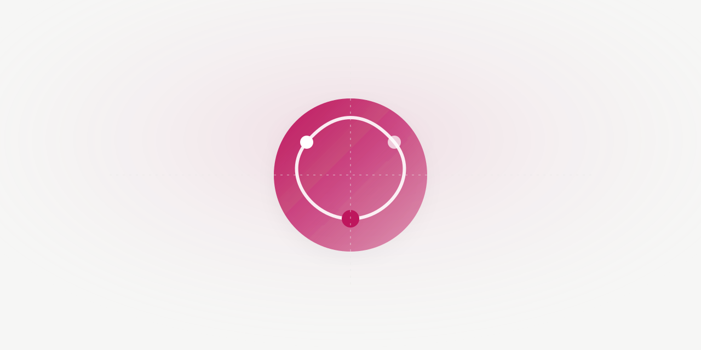
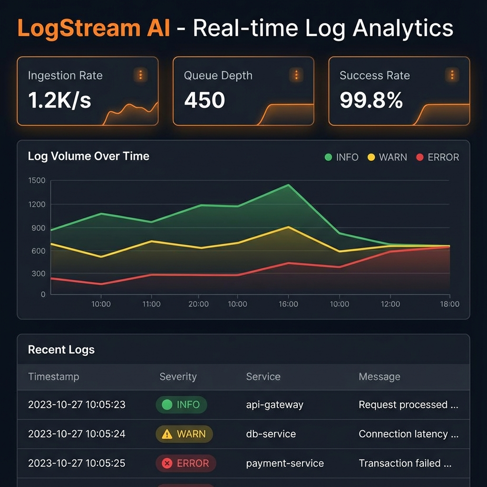

# LogStream AI



## High-Throughput Log Ingestion & Observability Platform

<div align="center">


</div>

**LogStream AI** is an enterprise-grade log ingestion system designed to handle **10,000+ requests per second** using an event-driven "Shock Absorber" architecture. It decouples ingestion from storage to guarantee **<10ms latency** for clients while protecting the database from write surges.

---

## 🚀 Quick Start

Get the system running in 3 commands:

```bash
# 1. Start Infrastructure (Redis & MongoDB)
docker-compose up -d

# 2. Install Dependencies (Root)
npm install

# 3. Start All Services (Concurrent)
npm run start:all 
# (Or start each service in separate terminals as detailed in GETTING_STARTED.md)
```

> **Detailed Setup**: See [GETTING_STARTED.md](./docs/GETTING_STARTED.md) for full instructions.

---

## 📸 Demo & Architecture

### Real-time Dashboard

*Live log analytics with severity-based visualization*

### System Architecture

*Event-driven flows with batch processing*

> **Deep Dive**: See [ARCHITECTURE.md](./docs/ARCHITECTURE.md) for High-Level & Low-Level Design.

---

## ✨ Key Features

*   **⚡ Zero-Latency Ingestion**: API offloads requests to Redis in **< 10ms**.
*   **🛡️ Robust Reliability**: "Shock Absorber" pattern handles sudden traffic spikes without data loss.
*   **📉 Database Optimization**: Batch processing reduces Database IOPS by **98%**.
*   **📊 Live Observability**: Real-time Next.js dashboard with instant search and filtering.
*   **🛡️ Type Safety**: Full TypeScript implementation with Zod validation.

---

## 📚 Documentation

| Document | Description |
| :--- | :--- |
| [**System Architecture**](./docs/ARCHITECTURE.md) | High-Level Design, Schema, and Tech Decisions. |
| [**Getting Started**](./docs/GETTING_STARTED.md) | Setup guide, environment variables, and scripts. |
| [**Failure Scenarios**](./docs/FAILURE_SCENARIOS.md) | Analysis of resilience and fault tolerance. |
| [**Interview Q&A**](./docs/INTERVIEW_QA.md) | "Senior Signal" answers for recruiters. |

---

## 🔧 Tech Stack

| Domain | Technology | Use Case |
| :--- | :--- | :--- |
| **Runtime** | **Node.js** | Async I/O for high throughput. |
| **Broker** | **Redis (BullMQ)** | In-memory buffering and queue management. |
| **Storage** | **MongoDB** | Schema-less document storage for logs. |
| **Frontend** | **Next.js 14** | Real-time dashboard with Server Actions. |

---

## 👤 Author

**Harshan Aiyappa**  
Senior Full-Stack Hybrid Engineer  
[GitHub Profile](https://github.com/Kimosabey)

---

## 📝 License

This project is licensed under the MIT License - see the [LICENSE](LICENSE) file for details.
