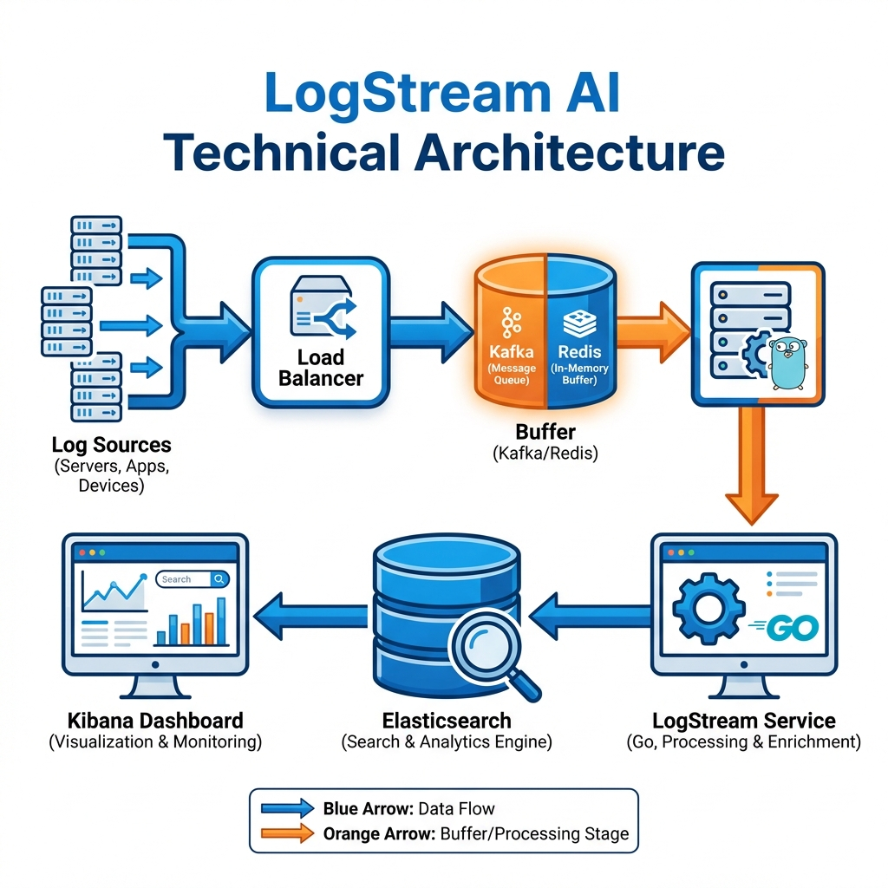
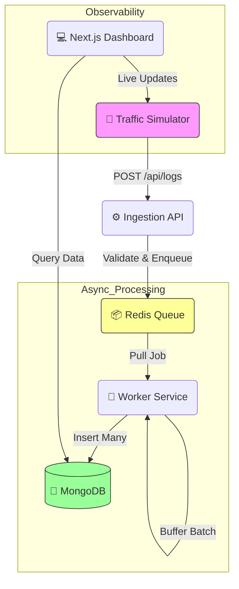

# 🏗️ System Architecture: LogStream AI

## 1. High-Level Design (HLD)

The system is designed as an **Asynchronous Event-Driven Ingestion Pipeline**. It decouples the high-throughput ingestion layer from the storage layer using a message broker, ensuring zero-latency writes for clients and protecting the database from write spikes.





### Core Components
1.  **Ingestion API (Node.js/Express)**: "The Receptionist". Accepts HTTP requests, validates payload using Zod, and pushes to Redis. Response time is < 10ms.
2.  **Message Broker (Redis/BullMQ)**: "The Buffer". Temporarily holds logs in memory. Allows the system to absorb traffic bursts (Shock Absorber).
3.  **Worker Service (Node.js)**: "The Consumer". Pulls batches from Redis and performs bulk-writes to MongoDB.
4.  **Storage (MongoDB)**: "The Archive". Stores structured JSON logs.
5.  **Dashboard (Next.js)**: "The View". Visualizes log data and system health in real-time.

---

## 2. Low-Level Design (LLD)

### Data Contracts
**Log Payload (Zod Schema)**
```typescript
{
  service: string;     // e.g., "auth-service"
  level: string;       // "INFO" | "ERROR" | "WARN"
  message: string;     // Log content
  timestamp: string;   // ISO 8601
  metadata: object;    // Optional JSON context
}
```

### Database Schema (MongoDB)
*   **Collection**: `logs`
*   **Indexes**:
    *   `timestamp`: Descending (for latest logs).
    *   `level`: For filtering errors.
    *   `service`: For service-specific views.

---

## 3. Decision Log

| Decision | Alternative | Reason for Choice |
| :--- | :--- | :--- |
| **Redis Queue** | RabbitMQ / Kafka | **Speed & Simplicity**. Redis is ultra-low latency for this scale (<10k TPS) and simpler to maintain than Kafka for this specific scope. |
| **MongoDB** | PostgreSQL | **Flexible Schema**. Logs are naturally JSON. MongoDB writes are fast, and schema evolution is easier for unstructured log data. |
| **Bulk Writes** | Single Inserts | **Performance**. Writing 1 log at a time saturates IOPS. Batching 50 logs reduces DB load by 98%. |
| **Next.js (App Router)** | React SPA | **SEO & Server Components**. Direct DB access from Server Components simplifies the architecture (no separate read-API needed for simple views). |

---

## 4. Key Patterns

### The "Shock Absorber" Pattern
Traffic in real-world systems is bursty. Instead of scaling the database to handle the peak (expensive), we use a Queue to smooth out the curve. The API accepts requests as fast as Redis can take them (microseconds), and the Worker writes to the DB at a constant, safe pace.

### Batch Processing
We use a **Time-based or Count-based** flush strategy in the worker:
*   Flush when buffer >= 50 logs
*   OR Flush every 5 seconds
This ensures data is not stale while maximizing write throughput.
