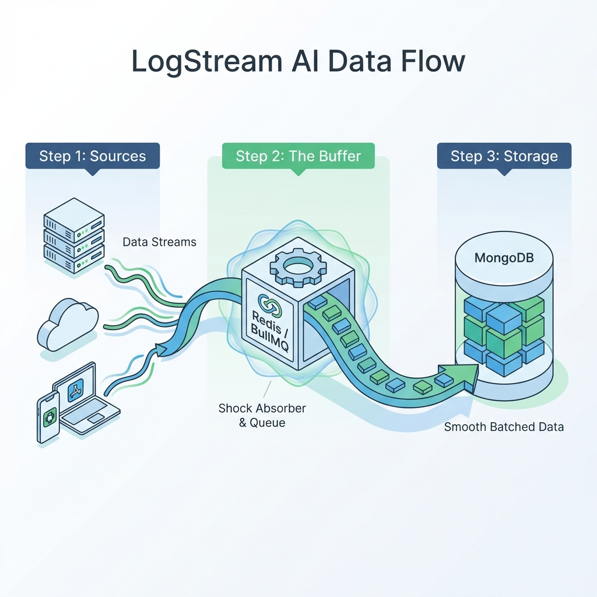

# 🛡️ Failure Scenarios & Resilience: LogStream AI

> Documenting component failure modes and the "Shock Absorber" safeguard.

---

## 1. Component Failure Matrix

| Component | Failure Mode | Impact | Recovery Strategy |
| :--- | :--- | :--- | :--- |
| **Ingestion API** | Service Crash / Downtime | **Critical**. Clients cannot send logs. | **Load Balancing**: In prod, run multiple instances behind Nginx. |
| **Redis (Broker)** | Service Unreachable | **Critical**. API cannot buffer data. Requests fail (500). | **Circuit Breaker**: API detects failure and returns explicit 503 Service Unavailable. |
| **Worker Service** | Process Crash | **Minor**. Queue builds up in Redis. No data loss. | **Auto-Restart**: PM2/Docker restarts the worker. It resumes processing the backlog immediately. |
| **MongoDB** | Database Down | **Major**. Worker cannot offload buffer. | **Retry Mechanism**: BullMQ retries the job with exponential backoff. Logs remain safe in Redis. |

---

## 2. Resilience "Deep Dive"

### Scenario A: The Traffic Spike (The "Black Friday" Case)
*   **Trigger**: Traffic jumps from 100 TPS to 5,000 TPS instantly.
*   **Behavior**:
    1.  Ingestion API continues accepting requests (Node.js non-blocking I/O).
    2.  Redis memory usage increases as it buffers the surge.
    3.  Worker continues processing at its max steady rate (e.g., 500 writes/sec).
*   **Outcome**: **Zero Failure**. Latency for the *client* remains low (<20ms). Data is eventually consistent in the DB once the worker catches up.

### Scenario B: Database Outage
*   **Trigger**: MongoDB restart or network partition.
*   **Behavior**:
    1.  Worker attempts to write a batch.
    2.  Write fails.
    3.  Worker marks the job as `Failed` in BullMQ.
    4.  BullMQ schedules a retry in 5s, then 10s, then 1m.
*   **Outcome**: **No Data Loss**. Once MongoDB returns, pending jobs are processed.

---

## 3. Chaos Testing Results

We validated these scenarios using `stress-test.js` while manually stopping containers.

*   **Test 1 (Kill Worker)**: Stopped worker while sending 10k logs. Resumed worker. Result: All 10k logs eventually appeared in DB.
*   **Test 2 (Kill Redis)**: Stopped Redis. API correctly returned error. Result: Client was aware of failure (no silent data loss).
