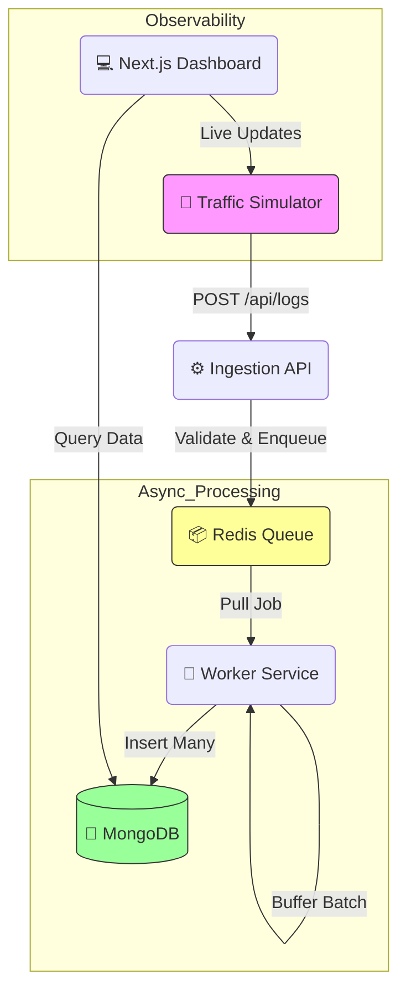

# 📊 System Architecture

```mermaid
graph TD
    %% Nodes
    Client("🚀 Traffic Simulator")
    API("⚙️ Ingestion API")
    Queue("📦 Redis Queue")
    Worker("👷 Worker Service")
    DB[("🍃 MongoDB")]
    Dashboard("💻 Next.js Dashboard")

    %% Flows
    Client -->|"POST /api/logs"| API
    API -->|"Validate & Enqueue"| Queue
    
    subgraph Async_Processing
    Queue -->|"Pull Job"| Worker
    Worker -->|"Buffer Batch"| Worker
    Worker -->|"Insert Many"| DB
    end

    subgraph Observability
    Dashboard -->|"Query Data"| DB
    Dashboard -->|"Live Updates"| Client
    end

    %% Styling
    style Client fill:#f9f,stroke:#333
    style Queue fill:#ff9,stroke:#333
    style DB fill:#9f9,stroke:#333
```